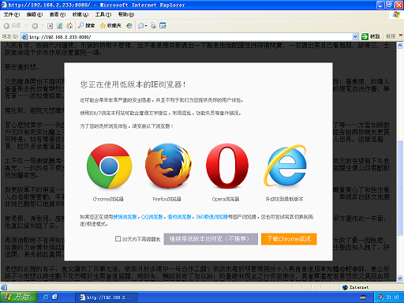

Anti-IE
=======

弹出提示，跪求用户别用IE6/IE7/IE8/各种IE内核奇葩浏览器了。

Notice the user that your website doesn't support IE6/7/8.

# 特性 Features

- 不依赖jQuery等库，自己的屁股自己擦。

    Independent form jQuery or other JS libs.

- 仅需载入js文件，css和图片自动加载。

    Only .js file need to be add in HTML.

- 提供外链，如果不在意被墙的话可以一懒到底。

    You can load the script on my Github page directly.

- 扁(tou)平(lan)设计，高(kuang)端(zhuai)大(ku)气(xuan)上(diao)档(zha)次(tian)。

    Flat designing. Pretty good look.

# 使用方法 Usage

## 1. 加载Github上的文件 Load from Github Pages

只需在html里面加上：

All you need is to copy the following code to your html:

    <!--[if lt IE 8]>
    
    <![endif]-->

如果你的网站还支持IE7，把条件注释里的8改成7。

If your website still support IE7, change 8 to 7 in the conditional comment.

优点：一步到位，仅需ctrl-c，alt-tab，ctrl-v三连击，不用谢。

Advantage: Very simple.

缺点：速度较慢，有被墙的危险。

Disadvantage: Probably be slow.

## 2. 拷贝文件加到自己的项目中 Copy the source files by yourself

分别把anti-ie.js，anti-ie.css，img文件夹下的4张图片拷到自己的项目里。

Download anti-ie.js, anti-ie.css and the 4 images under img folder, and copy them to your own project.

如果需要配置css和图片路径，在引入anti-ie.js前，声明全局对象`anti_ie_config`，并修改其`cssPath`和`imgPath`属性。
请注意，`cssPath`和`imgPath`都是**相对anti-ie.js的路径**。请注意在路径最后需要加斜杠。因为在js代码中会引用css和图片文件，因此**请不要修改文件名**。

If you need configure the css and image path, you can define a global object called `anti_ie_config`，and change its `cssPath` and `imgPath`. Please notice that `cssPath` and `imgPath` are **relative to the location of anti-ie.js**. Don't miss the slash at the end of the path. **Please don't change the files' name**, for the css and images files name are used in the js file.

    <!--[if lt IE 8]>
    
    
    <![endif]-->

# Bug或需求 Issues and Requirement

提交Bug或需求到https://github.com/lukeupup/Anti-IE/issues ，请尽量详细描述。

Please leave your comment at https://github.com/lukeupup/Anti-IE/issues if you find bugs or have any requirement.
